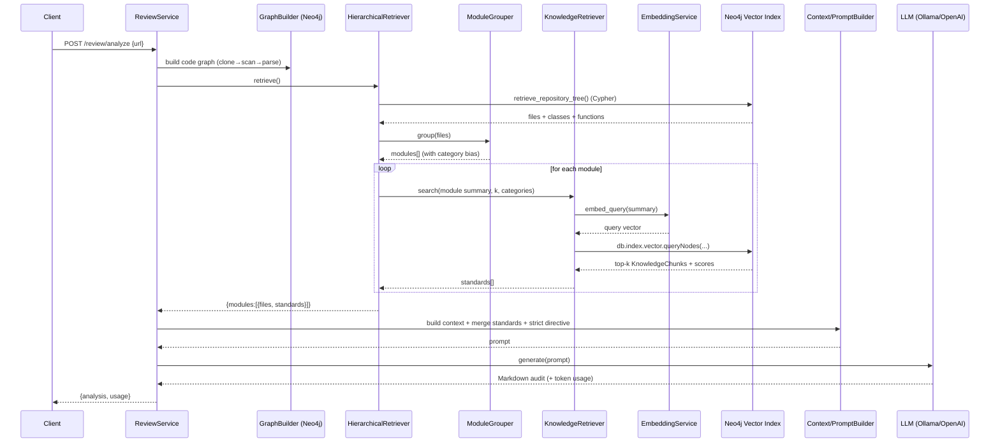

# RAG + LLM — Deep Dive

This document explains, in detail, how the **retrieval (RAG)** and **LLM** parts of
the project work: how the knowledge base is embedded and stored, how relevant
standards are retrieved for a repository, and how everything is assembled into a
prompt and turned into an audit. Diagrams and real data shapes included.

---

## 0. Mental model

There are **two corpora** and they are used very differently:

```
┌─────────────────────────────────────────────────────────────────────┐
│                              NEO4J                                    │
│                                                                       │
│   CODE GRAPH  (rebuilt per request)      KNOWLEDGE BASE (persistent)  │
│   ───────────────────────────────       ──────────────────────────   │
│   Repository → File → Class/Function     (:KnowledgeChunk {           │
│   linked by CONTAINS/DECLARES/CALLS/          text, category,         │
│   INHERITS_FROM/IMPORTS                       source, title,          │
│                                               embedding[768|1536] })  │
│   = STRUCTURE (what the repo contains)   = STANDARDS (how good code   │
│                                            should look) + VECTOR INDEX │
└─────────────────────────────────────────────────────────────────────┘
```

- The **code graph** answers "what is in this repository and how is it organized?"
  (deterministic, from AST + Cypher).
- The **knowledge base** answers "which coding standards are relevant here?"
  (semantic, via embeddings + vector search).

RAG = use the code graph to decide *what to search for*, then vector-search the
knowledge base to pull *only the relevant standards*, then hand both to the LLM.

---

## 1. Embeddings (the vector layer)

File: [embedding_service.py](backend/app/services/rag/embedding_service.py)

An embedding turns text into a fixed-length vector of floats. Similar meanings →
vectors that are close (cosine similarity). We embed two kinds of text:
- **Documents** = knowledge-base chunks (done once, at ingest).
- **Queries** = a description of a code module (done per request).

```
text  ──►  EmbeddingService._embed()  ──►  vector (list[float])
                │
                ├─ truncate to embedding.max_input_chars (default 4000)   ← guards model context
                ├─ open EMBEDDING span (Phoenix) + usage.record_embedding()
                └─ delegate to the backend:

     EMBEDDING_PROVIDER = ollama                 EMBEDDING_PROVIDER = openai
     ────────────────────────────                ────────────────────────────
     _OllamaEmbedder                             _OpenAIEmbedder
       model: nomic-embed-text                     model: text-embedding-3-small
       query   → "search_query: <text>"            query   → "<text>"  (no prefix)
       document→ "search_document: <text>"         document→ "<text>"
       dim: 768                                    dim: 1536
```

Key points:
- **Task prefixes**: nomic-embed-text is trained to use `search_query:` /
  `search_document:` prefixes — the facade applies them for Ollama, and *not* for
  OpenAI. This is why documents and queries go through different `document_text()`
  / `query_text()` methods.
- **Dimension**: nomic = 768, OpenAI small = 1536. The Neo4j vector index is created
  with whatever dimension the ingest produced, so **switching provider requires
  re-ingesting** (query vectors must match the index dimension).
- The facade is where truncation, tracing, and token accounting live once for both
  backends.

---

## 2. Building the knowledge base (offline, once)

Entry point: `python -m scripts.ingest_knowledge_base`
→ `KnowledgeBaseService.ingest()`
([knowledge_base_service.py](backend/app/services/rag/knowledge_base_service.py))

```
resources/knowledge_base/<category>/<doc>.md
        │
        │  MarkdownChunker.chunk_file()          [chunker.py]
        ▼
   split each doc on "## " headings → one chunk per section
   chunk = {
     id:       "security/owasp_top_10.md::2",
     text:     "OWASP Top 10 … — A03: Injection\n\nNever build SQL …",
     category: "Security",          ← from folder name via config.category_folders
     source:   "security/owasp_top_10.md",
     title:    "OWASP Top 10 … — A03: Injection"
   }
        │
        │  for each chunk:
        ▼
   EmbeddingService.embed_document(chunk.text) ─► 768-d vector
        │
        ▼
   GraphService.create_node("KnowledgeChunk", {id,text,category,source,title})
   GraphService.set_node_vector(id, "embedding", vector)     ← db.create.setNodeVectorProperty
        │
        ▼  (after all chunks)
   GraphService.create_vector_index(
       "knowledge_chunk_embedding", "KnowledgeChunk", "embedding",
       dimensions = len(first vector), similarity = "cosine")
```

Result in Neo4j:

```
(:KnowledgeChunk {
    id:       "code_quality/error_handling_and_logging.md::1",
    title:    "Error Handling and Logging — Never Silently Swallow Errors",
    category: "Code Quality",
    source:   "code_quality/error_handling_and_logging.md",
    text:     "…full section text…",
    embedding:[0.013, -0.021, …]       ← 768 (or 1536) floats
 })
 + VECTOR INDEX knowledge_chunk_embedding  ON (:KnowledgeChunk).embedding  (cosine)
```

Notes:
- One chunk per `##` section → semantically coherent, single-topic chunks. That is
  why a query about "swallowed exceptions" can hit exactly the right section.
- Re-ingest clears only `KnowledgeChunk` nodes (not the code graph), then rebuilds.

---

## 3. Retrieval at query time (the heart of the RAG)

This is what makes it **GraphRAG** and **hierarchical** rather than a flat "embed
the whole repo and search once". File:
[hierarchical_retriever.py](backend/app/services/rag/hierarchical_retriever.py)

### 3.1 Overview diagram

```
                 HierarchicalRetriever.retrieve()
                             │
   (a) Retriever.retrieve_repository_tree()          [retriever.py]  ── Cypher over CODE GRAPH
        │   rows: [{file, classes:[names], functions:[names]}, …]
        ▼
   (b) ModuleGrouper.group(rows)                     [module_grouper.py]
        │   assigns each file to ONE logical module (config-driven)
        │   → [ Module(authentication,[Security]), Module(services,[…]), … ]
        ▼
   (c) for EACH module:
        │
        │   summary = "path.py | classes: A | functions: f, g"  (its files)
        │   query   = "<module name>.\n<summary>"
        │
        │   KnowledgeRetriever.search(query, k=module_top_k, categories=module.categories)
        │        │
        │        ├─ EmbeddingService.embed_query(query) → query vector
        │        └─ Neo4j VECTOR SEARCH over KnowledgeChunk (see 3.4)
        │             → top-k standards for THIS module, biased to its categories
        ▼
   returns { modules: [ {name, categories, files, standards[]}, … ] }
```

### 3.2 (a) The code-graph tree query

`Retriever.retrieve_repository_tree()` runs one Cypher query:

```cypher
MATCH (r:Repository)-[:CONTAINS]->(file:PythonFile)
OPTIONAL MATCH (file)-[:DECLARES]->(c:PythonClass)
OPTIONAL MATCH (file)-[:DECLARES]->(fn:PythonFunction)
RETURN file,
       collect(DISTINCT c.name)  AS classes,
       collect(DISTINCT fn.name) AS functions
ORDER BY file.relative_path
```

Output rows (one per file):
```json
{ "file": {"relative_path": "app/auth/login.py", ...},
  "classes": ["LoginService"], "functions": ["verify", "issue_token"] }
```

### 3.3 (b) Module grouping — config-driven, whole-word

`ModuleGrouper` reads the `modules` list from
[config.json](resources/config.json). Each file goes to the **first** module whose
keywords match a **whole word** in its path (after naive singularization).

```
path: "app/services/review/review_service.py"
tokens (singularized): {app, service, review, review, service, py}
                                   ▲
      module "services" has keyword "service"  → MATCH → module = services

Why whole-word (not prefix):
   'tokenizer'  does NOT match keyword 'token'   (prefix matching wrongly did)
   'author'     does NOT match keyword 'auth'
   'models'     DOES match keyword 'model'       (singularized)
```

Each module carries `categories` (its retrieval bias):
```
authentication → [Security]
api            → [Architecture, Security, Maintainability]
database       → [Security, Performance, Architecture]
general        → [Code Quality, Maintainability, Architecture]   (catch-all, last)
```

### 3.4 (c) Semantic search over the knowledge base

`KnowledgeRetriever.search(query, k, categories)`
([knowledge_retriever.py](backend/app/services/rag/knowledge_retriever.py)):

```
query text ─► embed_query() ─► query vector
                                   │
        ┌──────────────────────────┴───────────────────────────┐
        │ categories given?                                     │
        │                                                       │
        NO                                                      YES
        │                                                       │
  queryNodes(index, k, vector)              queryNodes(index, k×overfetch, vector)
  YIELD node, score                         YIELD node, score
  RETURN top k                              WHERE node.category IN categories
                                            RETURN … LIMIT k
```

The Cypher (category-filtered form):
```cypher
CALL db.index.vector.queryNodes('knowledge_chunk_embedding', $fetch, $vector)
YIELD node, score
WHERE node.category IN $categories
RETURN node.text AS text, node.category AS category,
       node.source AS source, node.title AS title, score
LIMIT $k
```

- The vector index returns nearest neighbours by **cosine similarity** (score ~0–1,
  higher = closer).
- Category filtering runs *after* the vector search, so we **over-fetch**
  (`k × category_overfetch`, default 5×) and then filter+limit to still get `k`.
- `module_top_k` (default 4) standards per module; `repository_top_k` (default 8) is
  the fallback for non-module queries.

Returned per module:
```json
{ "name": "authentication",
  "categories": ["Security"],
  "files": [ {"relative_path":"app/auth/login.py","classes":["LoginService"],
              "functions":["verify"]} ],
  "standards": [
     {"category":"Security","title":"Secret Management … — Password Handling",
      "text":"…","source":"security/secrets_and_authentication.md","score":0.85},
     … up to module_top_k …
  ] }
```

### 3.5 Why hierarchical?

A flat approach ("embed the whole repo, search once") pulls a generic blend of
standards. Hierarchical retrieval instead asks a **separate, focused question per
module** and biases each toward its concerns:

- an `authentication` module pulls **Security** (password handling, auth),
- a `database` module pulls **Security + Performance + Architecture**,
- a `utilities` module pulls **Code Quality + Maintainability**.

So the LLM sees standards adjacent to the code they actually apply to, and generic
noise is filtered out.

---

## 4. From retrieval to prompt inputs

File: [context_builder.py](backend/app/services/builders/context_builder.py)

Two things are produced from the hierarchy:

**(1) `build_hierarchical_context(repo, hierarchy)`** → the human-readable
structure the LLM reasons over:
```
=== Repository ===
Name: myrepo
GitHub URL: https://github.com/owner/myrepo

=== Module: authentication ===
Focus areas: Security
Files (1):
- app/auth/login.py
    classes: LoginService
    functions: verify
Applicable standards: [Security] Secret Management … — Password Handling; …

=== Module: services ===
…
```

**(2) `merge_standards(hierarchy)`** → the full text of every retrieved standard,
**de-duplicated** across modules by `(source, title)`, keeping the highest score,
sorted by score. (Two modules can retrieve the same standard; it appears once.)

---

## 5. Prompt assembly + strict mode (two-phase)

File: [prompt_builder.py](backend/app/services/builders/prompt_builder.py). The
review is **map-reduce**, so there are two prompts:

```
PHASE 1 (map)  build_module_review_prompt(name, categories, code, standards):
   render "module_review.md" with:
       {{module_name}} {{focus_areas}}
       {{code}}             ← the module's REAL source, read from disk (capped by review.*)
       {{standards}}        ← format_standards(module.standards)
       {{strict_directive}} ← directive() -> loaded from resources/prompts/*_directive.md

PHASE 2 (reduce)  build_final_report_prompt(repository, summaries):
   render "final_report.md" with:
       {{repository}}  {{summaries}}   ← all Phase-1 module reviews concatenated
```

The strict/reference directive text is **not hardcoded** — `directive()` loads
`strict_directive.md` or `lenient_directive.md` from `resources/prompts/`.

`STRICT_KNOWLEDGE_BASE` (env, default `true`):
- **strict**: the LLM may grade the code **only** against the retrieved standards,
  and **every finding must cite `[Category] Title`**. No supporting standard → the
  finding is dropped. → reproducible, KB-traceable audits.
- **reference**: standards are a guide; general best practices allowed too.

The template also enforces: cite real code (`file › symbol`), no invented
topics/metrics, severity labels, fixed sections, justified health score.

---

## 6. The LLM call

Provider is chosen by `create_llm_service()`
([factory.py](backend/app/services/llm/factory.py)) from `LLM_PROVIDER`:

```
LLM_PROVIDER=ollama → OllamaService   (client.generate, model qwen2.5-coder:7b)
LLM_PROVIDER=openai → OpenAIService   (chat.completions.create, model gpt-4.x)
both:  generate(prompt: str) -> str
```

Inside `generate()`:
```
open LLM span (Phoenix): input.value = prompt, llm.model_name
call the model
extract token counts:
    Ollama → prompt_eval_count / eval_count
    OpenAI → response.usage.prompt_tokens / completion_tokens
usage.record_llm(prompt, completion)          ← per-request UsageCollector
span.set output.value + llm.token_count.*
return text (the Markdown audit)
```

Token totals are aggregated in [usage.py](backend/app/telemetry/usage.py) and
returned in the API response as `usage`, and stamped on the root Phoenix span.

---

## 7. Full end-to-end sequence (RAG + LLM)



(If your Markdown viewer doesn't render Mermaid, the same flow is the numbered
pipeline in [WORKFLOW.md](WORKFLOW.md) §4–5.)

---

## 8. Worked example

Repo has `app/auth/login.py` (class `LoginService`, fn `verify`) and
`app/utils/text.py` (fns `slugify`, `truncate`).

1. **Tree** → 2 file rows with their class/function names.
2. **Group** → `login.py` → **authentication** `[Security]`; `text.py` →
   **utilities** `[Code Quality, Maintainability]`.
3. **Retrieve (authentication)** → query `"authentication.\napp/auth/login.py |
   classes: LoginService | functions: verify"`, embed, vector-search filtered to
   `Security` → e.g. *Password Handling* (0.85), *Authentication* (0.80).
4. **Retrieve (utilities)** → filtered to `Code Quality`/`Maintainability` → e.g.
   *Clean Code — Small Functions*, *Naming and Documentation*.
5. **Context + standards** → module tree text + the de-duplicated standard texts.
6. **Prompt** (strict) → "grade only against these standards, cite each".
7. **LLM** → Markdown audit; findings like
   *[High] Password stored with fast hash — `app/auth/login.py › verify()` —
   Standard: [Security] … Password Handling*.

---

## 9. Tuning knobs (all in `resources/config.json` unless noted)

| Knob                          | Effect                                                        |
| ----------------------------- | ------------------------------------------------------------- |
| `retrieval.module_top_k`      | standards retrieved per module (context size vs recall)       |
| `retrieval.repository_top_k`  | standards for a whole-repo (non-module) query                 |
| `retrieval.category_overfetch`| how much to over-fetch before category filtering              |
| `chunking.section_heading`    | how KB docs are split into chunks                             |
| `embedding.max_input_chars`   | truncation guard for the embedding model context window       |
| `modules[].keywords`          | how files map to logical modules                              |
| `modules[].categories`        | which KB categories each module is biased toward              |
| `LLM_PROVIDER` (env)          | ollama or openai for generation                               |
| `EMBEDDING_PROVIDER` (env)    | ollama or openai for embeddings (re-ingest on change)         |
| `STRICT_KNOWLEDGE_BASE` (env) | strict KB-only grading vs reference mode                      |

---

## 10. One-line summary

**Graph decides *what* to ask about (modules) → embeddings + Neo4j vector index
retrieve *which* standards apply → the LLM reasons over code + standards under a
strict, KB-grounded prompt to produce the audit.**
